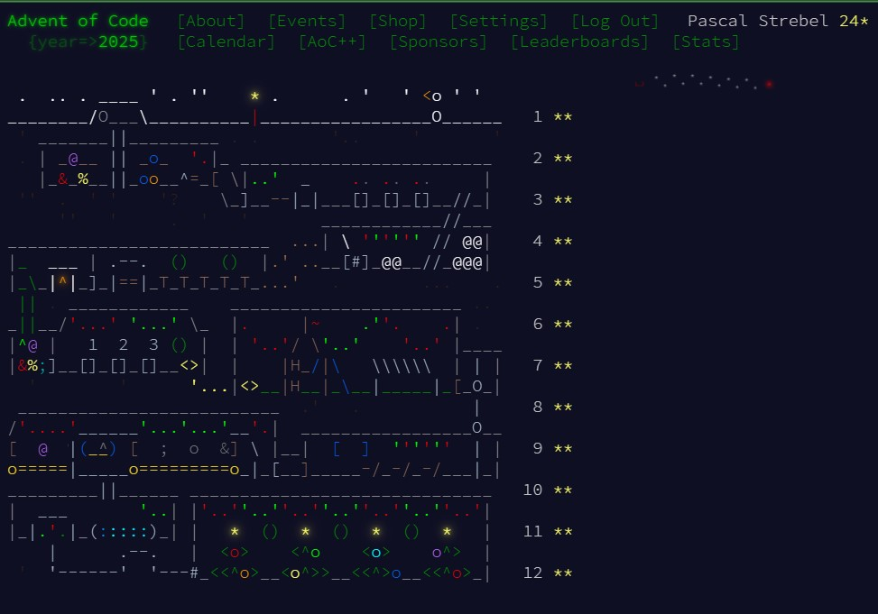

### Advent-of-Code-2025

[**Advent of Code**](https://adventofcode.com/2025/about) is an Advent calendar of small programming puzzles for a variety of skill sets and skill levels that can be solved in any programming language you like. People use them as interview prep, company training, university coursework, practice problems, a speed contest, or to challenge each other.

